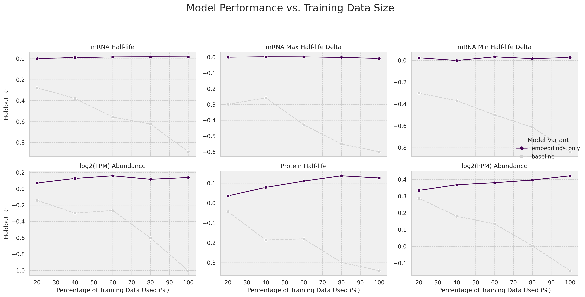
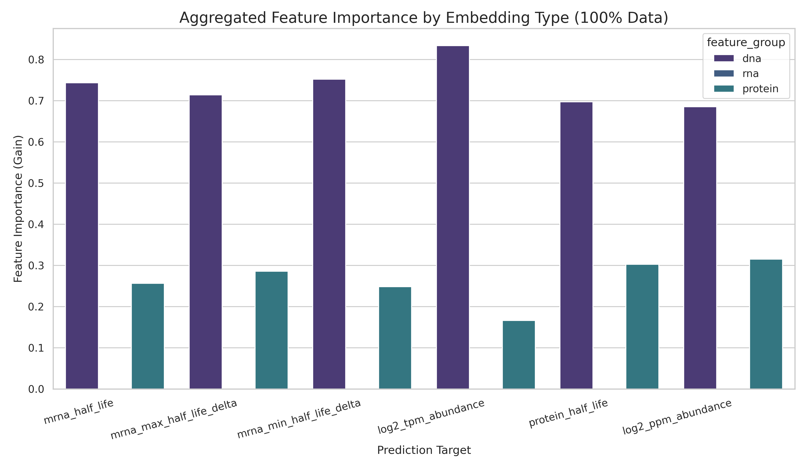
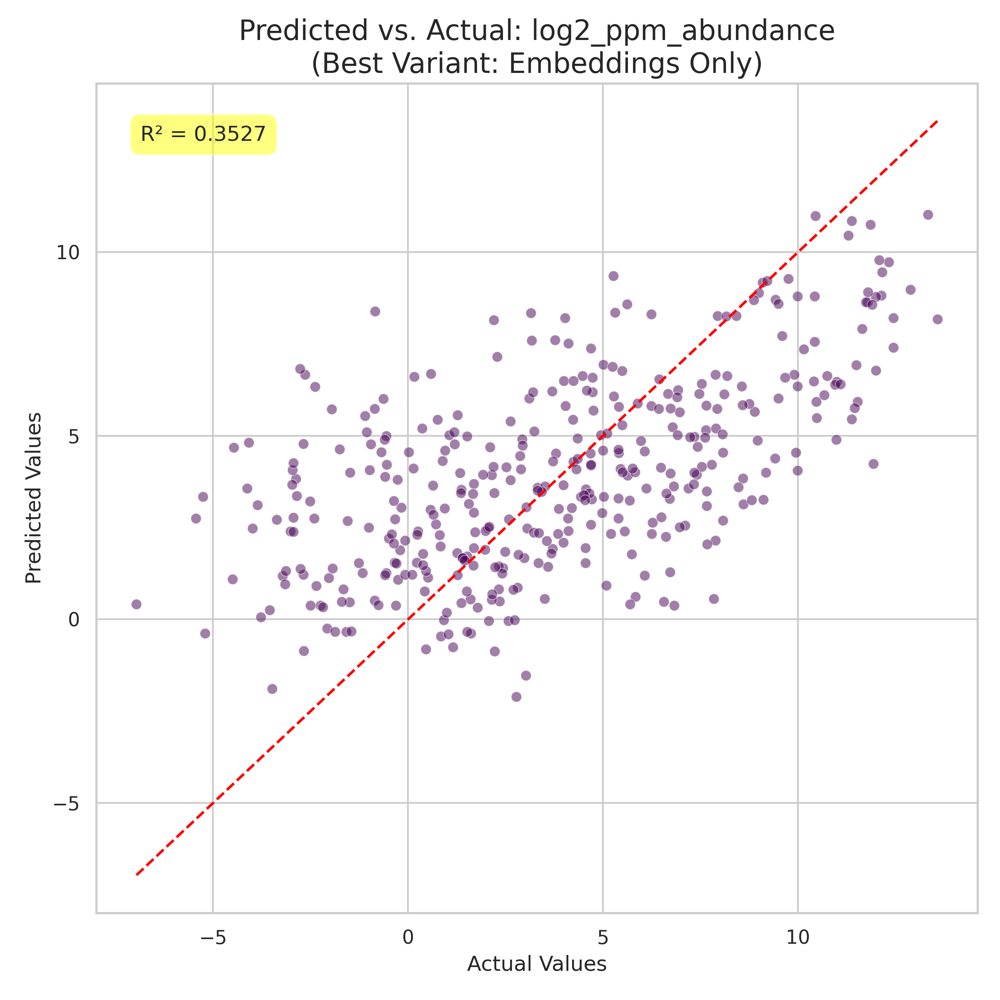

# Property Prediction Expression Prediction v1

A machine learning pipeline for predicting E. coli K-12 MG1655 protein expression characteristics using state-of-the-art biological sequence embeddings. This project combines DNA, RNA, and protein language models to predict multiple expression-related targets (protein/mRNA expression and half life).

> **Note:** This is the archived v1 of this project. Development has moved to v2 with a focus on protein expression, improved architecture, and additional features.

---

## Overview

This pipeline leverages pretrained transformer models to generate rich sequence embeddings, which are then used as features for XGBoost regression models optimized via Bayesian hyperparameter tuning.

### Prediction Targets

| Target | Description |
|--------|-------------|
| `log2_ppm_abundance` | Log2-transformed protein abundance (PPM) |
| `log2_tpm_abundance` | Log2-transformed transcripts per million |
| `protein_half_life` | Protein degradation half-life |
| `mrna_half_life` | mRNA stability half-life |
| `mrna_max_half_life_delta` | Maximum mRNA half-life variation |
| `mrna_min_half_life_delta` | Minimum mRNA half-life variation |

### Embedding Models

| Model | Type | Dimensions | Source |
|-------|------|------------|--------|
| **DNABERT-S** | DNA | 768 | [zhihan1996/DNABERT-S](https://huggingface.co/zhihan1996/DNABERT-S) |
| **RiNALMo** | RNA | 1024 | [multimolecule/rinalmo-giga](https://huggingface.co/multimolecule/rinalmo-giga) |
| **RNA-ERNIE** | RNA | 640 | [multimolecule/rnaernie](https://huggingface.co/multimolecule/rnaernie) |
| **ESM-2 15B** | Protein | 5120 | [facebook/esm2_t48_15B_UR50D](https://huggingface.co/facebook/esm2_t48_15B_UR50D) |

---

## Results

### Model Performance (100% Training Data)

The embeddings-only models (XGBoost with transformer embeddings) significantly outperform linear baseline models across all targets:

| Target | Baseline R² | Embeddings R² | Improvement |
|--------|------------|---------------|-------------|
| log2_ppm_abundance | -0.15 | **0.42** | ↑ 0.57 |
| log2_tpm_abundance | -1.00 | **0.14** | ↑ 1.14 |
| protein_half_life | -0.34 | **0.13** | ↑ 0.47 |
| mrna_half_life | -0.89 | **0.02** | ↑ 0.91 |

### Performance Scaling

Model performance as a function of training data size:



### Feature Importance Analysis

Relative contribution of each embedding type to predictions:



### Predicted vs Actual

Example prediction accuracy for protein abundance:



---

## Pipeline Architecture

```
┌─────────────────────────────────────────────────────────────────────┐
│                         Pipeline Overview                            │
├─────────────────────────────────────────────────────────────────────┤
│                                                                      │
│  1. Setup Environment    →  Install dependencies & CUDA setup        │
│         ↓                                                            │
│  2. Download Models      →  Fetch pretrained transformers            │
│         ↓                                                            │
│  3. Generate Embeddings  →  DNA + RNA + Protein embeddings           │
│         ↓                                                            │
│  4. Train Model          →  Bayesian-optimized XGBoost               │
│         ↓                                                            │
│  5. Predict              →  Generate predictions on holdout set      │
│         ↓                                                            │
│  6. Analyze Results      →  Comprehensive metrics & visualizations   │
│                                                                      │
└─────────────────────────────────────────────────────────────────────┘
```

---

## Installation & Usage

### Prerequisites

- Python 3.8+
- CUDA 11.8 compatible GPU (recommended: 40GB+ VRAM for ESM-2 15B)
- ~100GB disk space for models

### Quick Start

```bash
# Clone the repository
git clone https://github.com/tienhdsn-000001/protein_expression_prediction--v1-old.git
cd protein_expression_prediction--v1-old

# Setup environment (installs PyTorch, transformers, etc.)
bash 1_setup_environment.sh

# Download pretrained models
python 2_download_models.py

# Generate embeddings from sequences
python 3_generate_embeddings.py

# Run full training pipeline
bash run_evaluation.sh
```

### Individual Scripts

| Script | Purpose |
|--------|---------|
| `1_setup_environment.sh` | Install all Python dependencies with CUDA support |
| `2_download_models.py` | Download and cache pretrained transformer models |
| `3_generate_embeddings.py` | Generate embeddings for DNA, RNA, and protein sequences |
| `4_train_model.py` | Train XGBoost models with Bayesian optimization |
| `4b_continue_optimization.py` | Extended hyperparameter search with early stopping |
| `5_predict.py` | Generate predictions on holdout data |
| `6_analyze_results.py` | Create comprehensive metrics and visualizations |

### Pipeline Runners

```bash
# Full pipeline (clean run)
bash run_evaluation.sh

# Just embeddings + training
bash full.sh

# Post-training analysis only
bash post_train.sh
```

---

## Project Structure

```
protein_expression_prediction--v1-old/
├── 1_setup_environment.sh      # Environment setup
├── 2_download_models.py        # Model downloader
├── 3_generate_embeddings.py    # Embedding generator
├── 4_train_model.py            # Main training script
├── 4b_continue_optimization.py # Extended optimization
├── 5_predict.py                # Prediction script
├── 6_analyze_results.py        # Analysis & visualization
├── full.sh                     # Quick pipeline runner
├── post_train.sh               # Post-training analysis
├── run_evaluation.sh           # Full pipeline runner
├── Ecoli_Annotation_v3.tsv     # E. coli annotation data
├── reporting/                  # Generated visualizations
│   ├── *.png                   # Performance plots
│   └── *.md                    # Metric reports
└── README.md
```

---

## Technical Details

### Data Split Strategy

The pipeline uses operon-aware data splitting to prevent data leakage:
- Genes are grouped by shared upstream DNA sequence (75bp prefix)
- 90% of operon groups used for training/validation
- 10% held out for final evaluation
- GroupKFold cross-validation within training set

### Hyperparameter Optimization

Bayesian optimization via `scikit-optimize` with:
- 25 initial optimization calls per target
- 75 additional calls with early stopping (20-call patience)
- 3-fold GroupKFold cross-validation for scoring

### XGBoost Configuration

```python
{
    'objective': 'reg:squarederror',
    'tree_method': 'hist',
    'device': 'cuda',
    'max_bin': 128,  # Memory optimization
    # Plus Bayesian-optimized:
    # n_estimators, learning_rate, max_depth, subsample, colsample_bytree
}
```

---

## Requirements

Key dependencies (see `1_setup_environment.sh` for full list):

```
torch==2.1.2 (CUDA 11.8)
transformers==4.35.2
xgboost
scikit-optimize
multimolecule
cupy-cuda11x
pandas
numpy
seaborn
matplotlib
```

---

## Citation

If you use this code in your research, please cite:

```bibtex
@software{protein_expression_prediction_v1,
  author = {tienhdsn-000001},
  title = {Protein Expression Prediction v1},
  year = {2024},
  url = {https://github.com/tienhdsn-000001/protein_expression_prediction--v1-old}
}
```

---

## License

This project is provided for educational and research purposes.

---

## Acknowledgments

- [DNABERT-S](https://github.com/MAGICS-LAB/DNABERT_S) for DNA sequence modeling
- [MultiMolecule](https://github.com/DLS5-Omics/multimolecule) for RNA language models
- [ESM](https://github.com/facebookresearch/esm) for protein language modeling
- [XGBoost](https://xgboost.ai/) for gradient boosting
- [scikit-optimize](https://scikit-optimize.github.io/) for Bayesian optimization

